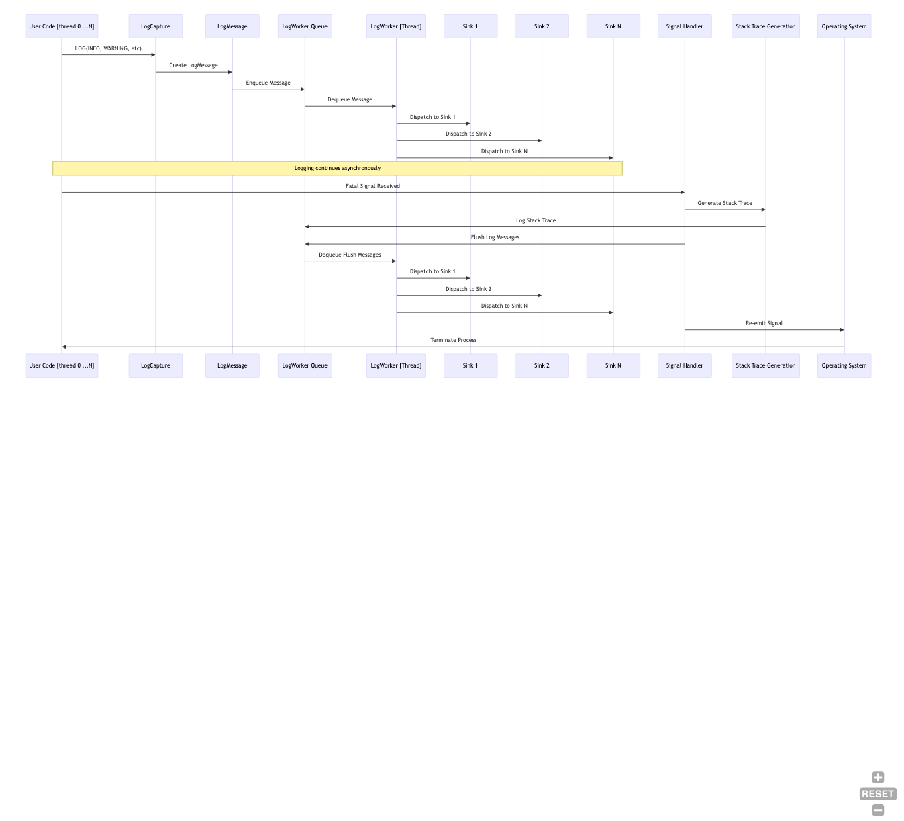
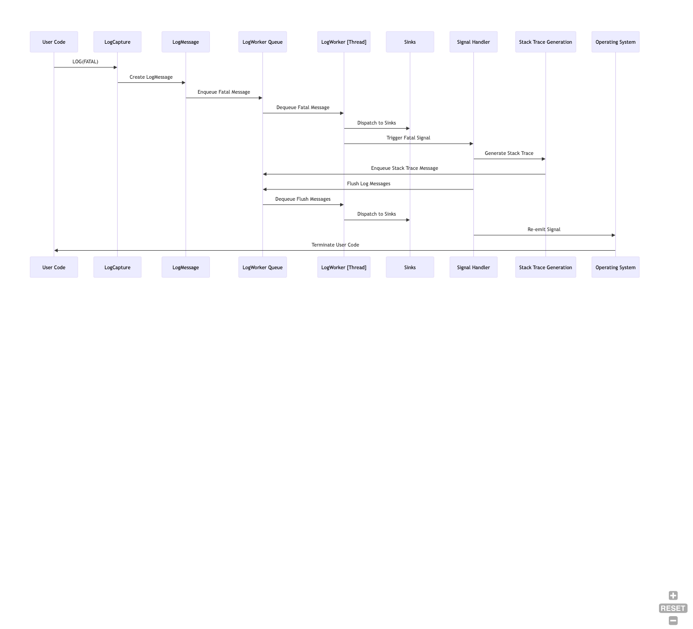
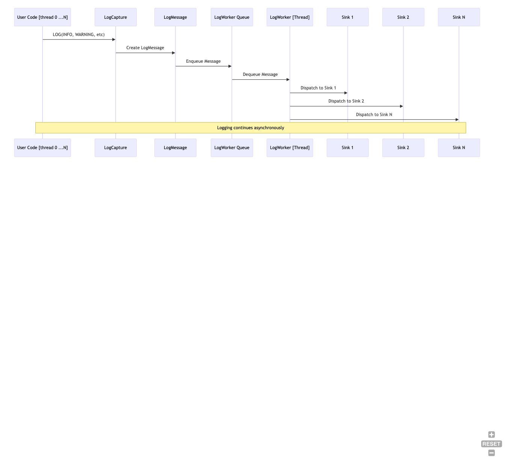
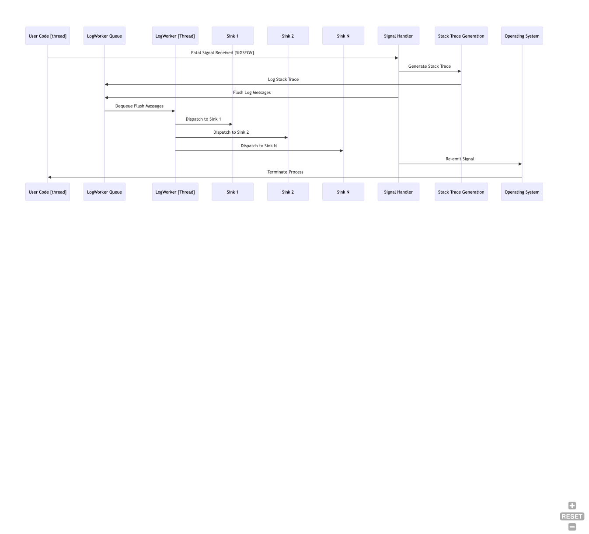

[introduction](index.md) | [detailed information](g3log_usage.md) | [Configure & Build](building.md) | [**API description**](API.md) | [Custom log formatting](API_custom_formatting.md)

# High Level Description of g3log
The `g3log` logger is an asynchronous, crash-safe logging library designed for C++ applications. It allows for logging messages to various sinks without blocking the main application thread. Below is a high-level overview of how the `g3log` logger works.

## Asynchronous Logging
The logger operates on a separate thread, ensuring that the main application thread is not blocked by I/O operations when logging messages. This is achieved by using a background worker ([`LogWorker`](../src/g3log/logworker.hpp)) that queues log messages and processes them asynchronously.

## LogWorker and Sinks
The `LogWorker` is responsible for managing the logging sinks. A sink is an object that defines where and how log messages are outputted (e.g., to a file, console, or over the network). Users can add custom sinks to the `LogWorker` using the `addSink` method, which takes a unique pointer to a sink object and a function pointer to the method that will save the log message.

## Signal Handling
The logger includes a signal handler for Unix-like systems that captures fatal signals (e.g., `SIGSEGV`, `SIGABRT`) and ensures that all pending log messages are flushed to the sinks before the application exits. The signal handler function ([`signalHandler`](../src/crashhandler_unix.cpp)) is registered to handle these signals and will attempt to generate a stack trace when a fatal signal is received. This stack trace is then logged, providing valuable debugging information.

## Stack Trace Generation
Upon receiving a fatal signal, the `signalHandler` function will call [`stackdump`](../src/crashhandler_unix.cpp) to generate a stack trace. This function uses platform-specific calls to retrieve the stack frames and attempts to demangle the function names to make the stack trace more readable.

## Log Message Formatting
Log messages can be formatted using either a streaming API (e.g., `LOG(INFO) << "message";`) or a printf-like syntax (e.g., `LOGF(INFO, "message %d", value);`). This provides flexibility in how messages are constructed.

## Log Levels
The library supports various log levels (e.g., `DEBUG`, `INFO`, `WARNING`, `FATAL`). Users can define custom log levels or modify the existing ones. The log levels can be dynamically enabled or disabled at runtime if the `G3_DYNAMIC_LOGGING` preprocessor definition is set.

## Crash Safety
In the event of a crash, the logger is designed to be crash-safe by catching fatal events and ensuring that all log messages are flushed to the sinks before the process exits.

## Customization
The library allows for extensive customization, including adding custom log levels, creating custom sinks, and overriding the default signal handling behavior.

## Thread Safety
The `g3log` logger is thread-safe, meaning it can be used from multiple threads without the need for additional synchronization.

## Public Domain Software
The `g3log` code is released into the public domain, allowing users to use, modify, and distribute it freely without restrictions.

## Logging and Fatal Events Explained
_diagrams created with https://mermaid.live_



# API description
Most of the API that you need for using g3log is described in this readme. For more API documentation and examples please continue to read the [API readme](API.md). Examples of what you will find here are: 


## Logging API: LOG calls
LOG calls can follow streaming ```LOG(INFO) << "some text" ``` or printf-like syntax ```LOGF(WARNING, "some number %d", 123); ```

Conditional logging is made with ```LOG_IF(INFO, <boolean-expression>) << " some text"  ``` or ```LOGF_IF(WARNING, <boolean-expression>) << " some text".```  Only if the expressions evaluates to ```true``` will the logging take place. 

Example:
```LOG_IF(INFO, 1 != 200) << " some text";```   or ```LOG_IF(FATAL, SomeFunctionCall()) << " some text";```

*<a name="fatal_logging">A call using FATAL</a>  logging level, such as the ```LOG_IF(FATAL,...)``` example above, will after logging the message at ```FATAL```level also kill the process.  It is essentially the same as a ```CHECK(<boolea-expression>) << ...``` with the difference that the ```CHECK(<boolean-expression)``` triggers when the expression evaluates to ```false```.*

## Contract API: CHECK calls
The contract API follows closely the logging API with ```CHECK(<boolean-expression>) << ...``` for streaming  or  (*) ```CHECKF(<boolean-expression>, ...);``` for printf-style.


If the ```<boolean-expression>``` evaluates to false then the the message for the failed contract will be logged in FIFO order with previously made messages. The process will then shut down after the message is sent to the sinks and the sinks have dealt with the fatal contract message. 


```CHECK_F(<boolean-expression>, ...);``` was the the previous API for printf-like CHECK. It is still kept for backwards compatability but is exactly the same as ```CHECKF```

# LOG(fATAL) or CHECK(false)
Fatal logging or failed `CHECK  calls follows the same handling. 



## Logging levels
 The default logging levels are ```DEBUG```, ```INFO```, ```WARNING``` and ```FATAL``` (see FATAL usage [above](#fatal_logging)). The logging levels are defined in [loglevels.hpp](https://github.com/KjellKod/g3log/tree/master/src/g3log/loglevels.hpp).

 For some windows framework there is a clash with the ```DEBUG``` logging level. One of the CMake [Build options](#build_options) can be used to then change offending default level from ```DEBUG``` TO ```DBUG```.

 **CMake option: (default OFF) ** ```cmake -DCHANGE_G3LOG_DEBUG_TO_DBUG=ON ..``` 

  ### disable/enabled levels at runtime
  Logging levels can be disabled at runtime. The logic for this happens in
  [loglevels.hpp](https://github.com/KjellKod/g3log/tree/master/src/g3log/loglevels.hpp), [loglevels.cpp](https://github.com/KjellKod/g3log/tree/master/src/loglevels.cpp) and [g3log.hpp](https://github.com/KjellKod/g3log/tree/master/src/g3log/g3log.hpp).

  There is a cmake option to enable the dynamic enable/disable of levels. 
  When the option is enabled there will be a slight runtime overhead for each ```LOG``` call when the enable/disable status is checked. For most intent and purposes this runtime overhead is negligable. 

  There is **no** runtime overhead for internally checking if a level is enabled//disabled if the cmake option is turned off. If the dynamic logging cmake option is turned off then all logging levels are enabled.

**CMake option: (default OFF)** ```cmake -DUSE_DYNAMIC_LOGGING_LEVELS=ON  ..``` 


  ### custom logging levels
  Custom logging levels can be created and used. When defining a custom logging level you set the value for it as well as the text for it. You can re-use values for other levels such as *INFO*, *WARNING* etc or have your own values. Any value with equal or higher value than the *FATAL* value will be considered a *FATAL* logging level. 
  
  **To keep in mind when adding your own custom levels.** 
1. If the cmake option `G3_DYNAMIC_LOGGING` is enabled then you must use `g3::only_change_at_initialization::addLogLevel(...)` to give g3log a record of your logging level and if it is an enabled or disbled logging level. 
1. If the cmake `G3_DYNAMIC_LOGGING` is turned OFF, then giving g3log a record of your logging level with 'addLogLevel(...) is **not needed** since no `"disbled/enabled"` check will happen - all logging levels will be considered enabled.

  Example:
  ```cpp
  // In CustomLoggingLevels.hpp
  #include <g3log/loglevels.hpp>

  // all values with a + 1 higher than their closest equivalet
  // they could really have the same value as well.

  const LEVELS FYI {DEBUG.value + 1, {"For Your Information"}}; 
  const LEVELS CUSTOM {INFO.value + 1, {"CUSTOM"}}; 
  const LEVELS SEVERE {WARNING.value +1, {"SEVERE"}};
  const LEVELS DEADLY {FATAL.value + 1, {"DEADLY"}}; 
  ```

More examples can be viwed in the [unit tests](https://github.com/KjellKod/g3log/blob/master/test_unit/test_io.cpp). 


  
## Sink <a name="sink_creation">creation</a> and utilization 
The default sink for g3log is the one as used in g2log. It is a simple file sink with a limited API. The details for the default file sink can be found in [filesink.hpp](https://github.com/KjellKod/g3log/tree/master/src/g3log/filesink.hpp), [filesink.cpp](https://github.com/KjellKod/g3log/tree/master/src/filesink.cpp), [filesinkhelper.ipp](https://github.com/KjellKod/g3log/tree/master/src/filesinkhelper.ipp)

More sinks can be found at [g3sinks](http://www.github.com/KjellKod/g3sinks) (log rotate, log rotate with filtering on levels)

A logging sink is not required to be a subclass of a specific type. The only requirement of a logging sink is that it can receive a logging message of 


### Using the default sink
Sink creation is defined in [logworker.hpp](https://github.com/KjellKod/g3log/tree/master/src/g3log/logworker.hpp) and used in [logworker.cpp](https://github.com/KjellKod/g3log/tree/master/src/logworker.cpp). For in-depth knowlege regarding sink implementation details you can look at [sinkhandle.hpp](https://github.com/KjellKod/g3log/tree/master/src/g3log/sinkhandle.hpp) and [sinkwrapper.hpp](https://github.com/KjellKod/g3log/tree/master/src/g3log/sinkwrapper.hpp)
```cpp
  std::unique_ptr<FileSinkHandle> addDefaultLogger(
            const std::string& log_prefix
            , const std::string& log_directory
            , const std::string& default_id = "g3log");
```

With the default id left as is (i.e. "g3log") a creation of the logger in the unit test "test_filechange" would look like this
```cpp
  const std::string directory = "./";
  const std::string name = "(ReplaceLogFile)";
  auto worker = g3::LogWorker::createLogWorker();
  auto handle = worker->addDefaultLogger(name, directory);
```
The resulting filename would be something like: 
```
   ./(ReplaceLogFile).g3log.20160217-001406.log
```

## Designate the sink function's log entry receving function
The default log formatting look can be overriden by any sink. 
If the sink receiving function calls `toString()` then the default log formatting will be used.
If the sink receiving function calls `toString(&XFunc)` then the `XFunc`will be used instead (see `LogMessage.h/cpp` for code details if it is not clear). (`XFunc` is a place holder for *your* formatting function of choice). 

The API for the function-ptr to pass in is 
```cpp
std::string (*) (const LogMessage&)
```
or for short as defined in `LogMessage.h`
```cpp
using LogDetailsFunc = std::string (*) (const LogMessage&);
```

## Log format customization
Please see[API_custom_formatting.md](API_custom_formatting.md)


## LOG <a name="log_flushing">flushing</a> 
The default file sink will flush each log entry at set intervals. The default buffer size for flushing is set to 100 entries. You can adjust this down to 1, or as high as makes sense for your system. Please see [FileSink](https://github.com/KjellKod/g3log/blob/master/src/g3log/filesink.hpp#L18) 

Even more flushing policies and log rotations can be found at  g3sinks [logrotate and LogRotateWithFilters](https://github.com/KjellKod/g3sinks/tree/master/sink_logrotate).

At shutdown all enqueued logs will be flushed to the sink.  
At a discovered fatal event (SIGSEGV et.al) all enqueued logs will be flushed to the sink.

A programmatically triggered abrupt process exit such as a call to   ```exit(0)``` will of course not get the enqueued log entries flushed. Similary  a bug that does not trigger a fatal signal but a process exit will also not get the enqueued log entries flushed.  G3log can catch several fatal crashes and it deals well with RAII exits but magic is so far out of its' reach.





## G3log and Sink Usage Code Example
Example usage where a [logrotate sink (g3sinks)](https://github.com/KjellKod/g3sinks) is added. In the example it is shown how the logrotate API is called. The logrotate limit is changed from the default to instead be 10MB. The limit is changed by calling the sink handler which passes the function call through to the actual logrotate sink object.
```cpp

// main.cpp
#include <g3log/g3log.hpp>
#include <g3log/logworker.h>
#include <g3sinks/LogRotate.h>
#include <memory>

int main(int argc, char**argv) {
   using namespace g3;
   std::unique_ptr<LogWorker> logworker{ LogWorker::createLogWorker() };
   auto sinkHandle = logworker->addSink(std::make_unique<LogRotate>(),
                                          &LogRotate::save);
   
   // initialize the logger before it can receive LOG calls
   initializeLogging(logworker.get());            
            
   // You can call in a thread safe manner public functions on the logrotate sink
   // The call is asynchronously executed on your custom sink.
   const int k10MBInBytes = 10 * 1024 * 1024;
   std::future<void> received = sinkHandle->call(&LogRotate::setMaxLogSize, k10MBInBytes);
   
   // Run the main part of the application. This can be anything of course, in this example
   // we'll call it "RunApplication". Once this call exits we are in shutdown mode
   RunApplication();

   // If the LogWorker is initialized then at scope exit the g3::shutDownLogging() will be 
   // called automatically. 
   //  
   // This is important since it protects from LOG calls from static or other entities that will go out of
   // scope at a later time. 
   //
   // It can also be called manually if for some reason your setup is different then the one highlighted in
   // this example
   g3::shutDownLogging();
}
```


## Dynamic Message Sizing <a name="dynamic_message_sizing"></a>
The default build uses a fixed size buffer for formatting messages. The size of this buffer is 2048 bytes. If an incoming message results in a formatted message that is greater than 2048 bytes, it will be bound to 2048 bytes and will have the string ```[...truncated...]``` appended to the end of the bound message. There are cases where one would like to dynamically change the size at runtime. For example, when debugging payloads for a server, it may be desirable to handle larger message sizes in order to examine the whole payload. Rather than forcing the developer to rebuild the server, dynamic message sizing could be used along with a config file which defines the message size at runtime.

This feature supported as a CMake option:

**CMake option: (default OFF)** ```cmake -DUSE_G3_DYNAMIC_MAX_MESSAGE_SIZE=ON ..```

The following is an example of changing the size for the message.

```cpp
    g3::only_change_at_initialization::setMaxMessageSize(10000);
```


## Fatal handling
The default behaviour for G3log is to catch several fatal events before they force the process to exit. After <i>catching</i> a fatal event a stack dump is generated and all log entries, up to the point of the stack dump are together with the dump flushed to the sink(s).




### <a name="fatal_handling_linux">Linux/*nix</a> 
  The default fatal handling on Linux deals with fatal signals. At the time of writing these signals were   ```SIGABRT, SIGFPE, SIGILL, SIGSEGV, SIGTERM```.  The Linux fatal handling is handled in [crashhandler.hpp](https://github.com/KjellKod/g3log/tree/master/src/g3log/crashhandler.hpp) and [crashhandler_unix.cpp](https://github.com/KjellKod/g3log/tree/master/src/crashhandler_unix.cpp)


   A signal that commonly is associated with voluntarily process exit is ```SIGINT``` (ctrl + c) G3log does not deal with it. 

   The fatal signals can be [disabled](#fatal_handling_disabled) or  [changed/added ](#fatal_signalhandler_override). 

   An example of a Linux stackdump as shown in the output from the fatal example <i>g3log-FATAL-sigsegv</i>.
    ```
    ***** FATAL SIGNAL RECEIVED ******* 
    "Received fatal signal: SIGSEGV(11)     PID: 6571

    ***** SIGNAL SIGSEGV(11)

    ******* STACKDUMP *******
            stack dump [1]  ./g3log-FATAL-sigsegv() [0x42a500]
            stack dump [2]  /lib/x86_64-linux-gnu/libpthread.so.0+0x10340 [0x7f83636d5340]

            stack dump [3]  ./g3log-FATAL-sigsegv : example_fatal::tryToKillWithAccessingIllegalPointer(std::unique_ptr<std::__cxx11::basic_string<char, std::char_traits<char>, std::allocator<char> >, std::default_delete<std::__cxx11::basic_string<char, std::char_traits<char>, std::allocator<char> > > >)+0x119 [0x4107b9]
            stack dump [4]  ./g3log-FATAL-sigsegvmain+0xdec [0x40e51c]
            stack dump [5]  /lib/x86_64-linux-gnu/libc.so.6__libc_start_main+0xf5 [0x7f8363321ec5]
            stack dump [6]  ./g3log-FATAL-sigsegv() [0x40ffa2]

    Exiting after fatal event  (FATAL_SIGNAL). Fatal type:  SIGSEGV
    Log content flushed sucessfully to sink

    "
    g3log g3FileSink shutdown at: 16:33:18

    ```

### <a name="fatal_custom_handling">Custom fatal handling - override defaults</a>
   By <a name="fatal_signalhandler_override">default</a> the fatal signals are defined in [https://github.com/KjellKod/g3log/tree/master/src/g3log.cpp](https://github.com/KjellKod/g3log/tree/master/src/g3log.cpp) as 
   ```
   SIGABRT
   SIGFPE
   SIGILL
   SIGSEGV
   SIGTERM
   ```
   If you want to define your own set of fatal signals, override the default ones, then this can be done as shown in [src/g3log/crashhandler.hpp](https://github.com/KjellKod/g3log/tree/master/src/g3log/crashhandler.hpp)
   ```cpp
   // Example when SIGTERM is skipped due to ZMQ usage
   g3::overrideSetupSignals({ {SIGABRT, "SIGABRT"}, 
                              {SIGFPE, "SIGFPE"},
                              {SIGILL, "SIGILL"},
                              {SIGSEGV, "SIGSEGV"}});
   ```
   
### <a name="fatal_pre_hook">Pre fatal hook</a>
   You can define a custom call back function that will be called before the fatal signal handling re-emits the `fatal` signal. See [src/g3log/g3log.hpp](https://github.com/KjellKod/g3log/tree/master/src/g3log/g3log.hpp) for details. 
   ```
   // Example of how to enforce important shutdown cleanup even in the event of a fatal crash: 
   g3::setFatalPreLoggingHook([]{ cleanup(); });
   ```
   
### <a name="fatal_handling_disabled">Disable fatal handling</a>
   Fatal signal handling can be disabled with a CMake option: `ENABLE_FATAL_SIGNALHANDLING`. See [Options.cmake](https://github.com/KjellKod/g3log/Options.cmake) for more details


### <a name="PID1">PID1 Fatal Signal Recommendations</a>
  If you are using g3log on a PID1 process then you absolutely should provide your own signal handling  (ref: [issue 269](https://github.com/KjellKod/g3log/issues/269)) as g3log re-emits the fatal signal after it has restored the previous signal handler for that signal.  PID1 processed do *not* shutdown the process for a normal fatal signal so the choice  to exit the PID1 process after such a signal must be taken by the coder - not by g3log.

## <a name="fatal_handling_windows">Windows</a>
  Windows fatal handling also deals with fatal signals just like Linux. In addition to fatal signals it also deals with unhandled exceptions, vectored exceptions.  Windows fatal handling is handled in [crashhandler.hpp](https://github.com/KjellKod/g3log/tree/master/src/g3log/crashhandler.hpp), [crashhandler_windows.cpp](https://github.com/KjellKod/g3log/tree/master/src/crashhandler_windows.cpp), [stacktrace_windows.hpp](https://github.com/KjellKod/g3log/tree/master/src/g3log/stacktrace_windows.hpp), [stacktrace_windows.cpp](https://github.com/KjellKod/g3log/tree/master/src/stacktrace_windows.cpp)
 
  An example of a Windows stackdump as shown in the output from the fatal example <i>g3log-FATAL-sigsegv</i>. 

[introduction](index.md) | [detailed information](g3log_usage.md) | [Configure & Build](building.md) | [**API description**](API.md) | [Custom log formatting](API_custom_formatting.md)
